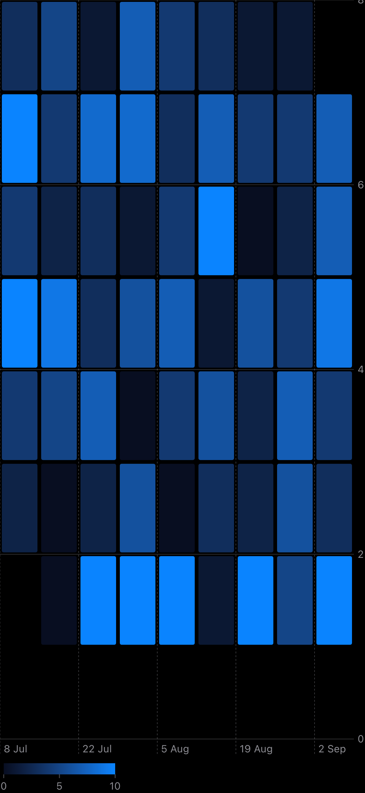
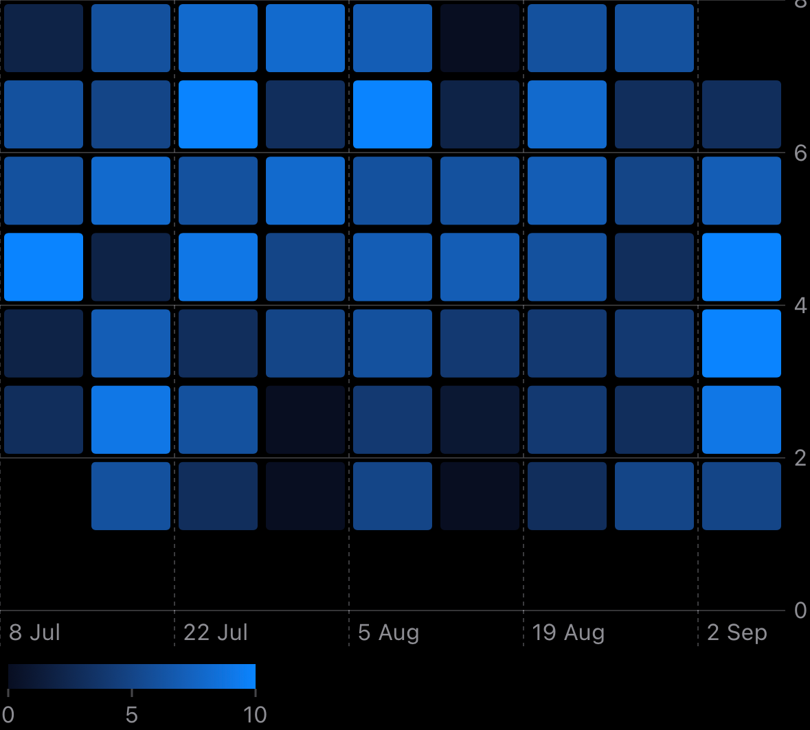

In 2022 Apple introduced a brand new SwiftUI framework — [Swift Charts](https://developer.apple.com/documentation/charts). You can use it to visualize data with rich customization and minimal code. Swift Charts is available in iOS 16+ and supports watchOS and macOS as well.
In this article I'll guide you through recreating Github Contribution Graph. Let's start!

## Decomposing the graph

[My graph](https://github.com/artemnovichkov) looks like:


At its core, it's a [heatmap](https://en.wikipedia.org/wiki/Heat_map), where:
- x-axis represents the weeks, labeled with the corresponding months;
- y-axis displays the weekdays, labeled with Mon, Wed, and Fri;
- Value indicates the count of contributions made to repositories on GitHub, displayed using different color intensities;
- Legend shows color gradient.

## Preparing the data

Let's start by defining a data structure to represent each contribution:

```swift
import Foundation

struct Contribution: Identifiable {

    let date: Date
    let count: Int

    var id: Date {
        date
    }
}
```

Here, the `Contribution` struct captures the `date` when a contribution was made and the `count` of contributions on that particular day.

Since my GitHub activity has been a bit low recently 😅, let’s mock contribution data for the last 60 days using random values:

```swift
extension Contribution {

    static func generate() -> [Contribution] {
        var contributions: [Contribution] = []
        let toDate = Date.now
        let fromDate = Calendar.current.date(byAdding: .day, value: -60, to: toDate)!

        var currentDate = fromDate
        while currentDate <= toDate {
            let contribution = Contribution(date: currentDate, count: .random(in: 0...10))
            contributions.append(contribution)
            currentDate = Calendar.current.date(byAdding: .day, value: 1, to: currentDate)!
        }

        return contributions
    }
}
```

## Creating the chart

To bring this data to life, we’ll import the Charts framework and prepare a content view:

```swift
import SwiftUI
import Charts

struct ContentView: View {

    @State var contributions: [Contribution] = Contribution.generate()

    var body: some View {
        // Chart implementation goes here
    }
}
```

Base view for any chart is a `Chart`, and for each contribution we'll use `RectangleMark`:

```swift
Chart(contributions) { contribution in
    RectangleMark(
        xStart: .value("Start week", contribution.date, unit: .weekOfYear),
        xEnd: .value("End week", contribution.date, unit: .weekOfYear),
        yStart: .value("Start weekday", weekday(for: contribution.date)),
        yEnd: .value("End weekday", weekday(for: contribution.date) + 1)
    )
}
```

`RectangleMark` offers several initializers. In this case, we use the one that allows setting the x and y ranges. This configuration is good for a heatmap layout. Every parameter is a `PlottableValue`, a labeled data struct. For x values we use the date value and combine it by week of year. For y values we convert the date to a weekday. I prefer to start my week from Monday, so I'll adjust it:

```swift
private func weekday(for date: Date) -> Int {
    let weekday = Calendar.current.component(.weekday, from: date)
    let adjustedWeekday = (weekday == 1) ? 7 : (weekday - 1)
    return adjustedWeekday
}
```

And here's a result:


Great result for a few lines of code! Chart customization is based on modifiers, so let's add some to change the appearance:

```swift
RectangleMark(/*...*/)
  .clipShape(RoundedRectangle(cornerRadius: 4).inset(by: 2))
  .foregroundStyle(by: .value("Count", contribution.count))
```

`clipShape` modifier allows you to make a shape that fills each mark’s frame. You can use it as a mask. `foregroundStyle` modifier applies color styling. You can set a solid color, gradient, or you can pass `PlottableValue` that will change the color based on the value:



This looks much better! The chart is now functional and displays the data. It even shows a legend based on count range. To ensure the chart’s marks are square, we can apply `chartPlotStyle` modifier. It allows you to change frame or aspect ratio of a plot area:

```swift
Chart(/*...*/)
  .chartPlotStyle { content in
      content
        .aspectRatio(aspectRatio, contentMode: .fit)
  }

private var aspectRatio: Double {
    if contributions.isEmpty {
        return 1
    }
    let firstDate = contributions.first!.date
    let lastDate = contributions.last!.date
    let firstWeek = Calendar.current.component(.weekOfYear, from: firstDate)
    let lastWeek = Calendar.current.component(.weekOfYear, from: lastDate)
    return Double(lastWeek - firstWeek + 1) / 7
}
```

Y-axis always contains 7 values, and x-axis depends on the data and based on weeks count:



And colors! Originally the contribution graph shows gray color for zero contributions and shades of green for other values. I found this solution for my case:

```swift
Chart(/*...*/)
.chartForegroundStyleScale(range: Gradient(colors: colors))

private var colors: [Color] {
    (0...10).map { index in
        if index == 0 {
            return Color(.systemGray5)
        }
        return Color(.systemGreen).opacity(Double(index) / 10)
    }
}
```

`chartForegroundStyleScale` modifier helps to apply foreground style scale. Pretty obvious, but tricky in real projects. You can simply use two colors like `Gradient(colors: [.white, .green])` if it fits your data representation, but it's not our case. Moreover, the colors will be related to count range. For example, if the maximum count in your data set will be 8, it will be solid green. You may ask: can we just use `colors` array as a `range` parameter? Yes, but the chart legend won't show up even if you set it explicitly. After these experiments I stopped at the variant with gradient:


Next, let's customize the x and y axes for better readability.

## Customizing the axes

For the x-axis we'll show only month labels at the top of the chart and change the color:

```swift
Chart(/*...*/)
.chartXAxis {
    AxisMarks(position: .top, values: .stride(by: .month)) {
        AxisValueLabel(format: .dateTime.month())
            .foregroundStyle(Color(.label))
    }
}
```

`AxisMarks` is a group of visual marks such as `AxisValueLabel`, `AxisGridLine`, or `AxisTick`. You can use a default logic and formatting or handle the exact value and show it with custom views. Let's try it with y-axis:

```swift
Chart(/*...*/)
.chartYAxis {
    AxisMarks(position: .leading, values: [1, 3, 5]) { value in
        if let value = value.as(Int.self) {
            AxisValueLabel {
                // Symbols from Calendar.current starting with Monday
                Text(shortWeekdaySymbols[value - 1])
            }
            .foregroundStyle(Color(.label))
        }
    }
}
```

In the above code, we customize the y-axis to display only Monday, Wednesday, and Friday. To show Monday at the top and remove extra gap between 0 and 1 on x-axis, we can modify a scale of the axis via:

```swift
Chart(/*...*/)
.chartYScale(domain: .automatic(includesZero: false, reversed: true))
```

## The legend of ~~Zelda~~ the chart

Finally, let’s enhance the chart with a color-coded legend to visually indicate the range of contribution values, from 'Less' to 'More':

```swift
Chart(/*...*/)
.chartLegend {
    HStack(spacing: 4) {
        Text("Less")
        ForEach(legendColors, id: \.self) { color in
            color
                .frame(width: 10, height: 10)
                .cornerRadius(2)
        }
        Text("More")
    }
    .padding(4)
    .foregroundStyle(Color(.label))
    .font(.caption2)
}

private var legendColors: [Color] {
    Array(stride(from: 0, to: colors.count, by: 2).map { colors[$0] })
}
```

It overrides the default legend with a custom one. You can also change the legend position like `.chartLegend(position: .bottomTrailing)`, but with this code the legend is placed at the top left corner of the plot and ovelap it. It seems like a bug, so let's leave a default position and see the final result:


## Conclusion

Swift Charts is a truly interesting framework. It's designed in SwiftUI style: declarative syntax, some magic default behaviour and lack of documentation in some cases. Classic SwiftUI 😅. Thankfully, the community has provided plenty of chart examples, and I’ve compiled the resources that helped me in one place — [Awesome Swift Charts](https://github.com/artemnovichkov/awesome-swift-charts). This article is my way to explore the framework, implement production-ready design and highlight non-obvious logic. And, of course, share my experience with you!

Check [Github Contribution Graph Example](https://github.com/artemnovichkov/GithubContributionGraphExample) project to see the final result. Thanks for reading!
